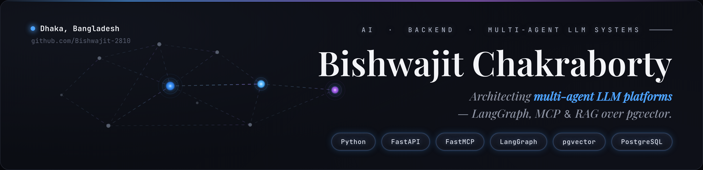
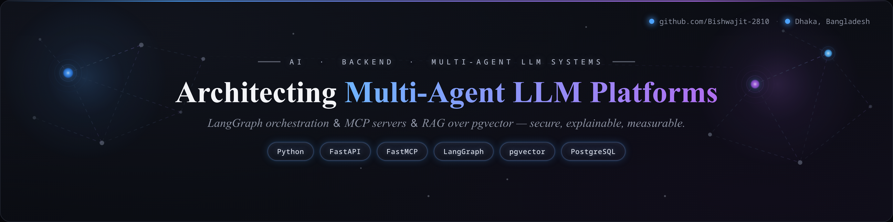

# LinkedIn / GitHub Banner Generator

Self-contained HTML files that render a dark, modern profile banner (glowing multi-agent
network graph, serif headline, and tech-stack chips). Open one in a browser and export it to
a high-quality PNG/JPG at any resolution. No build step, no JS dependencies.

## Two variants

| File                                         | Size       | Best for                 | Headline                                   |
| -------------------------------------------- | ---------- | ------------------------ | ------------------------------------------ |
| [banner.html](banner.html)                   | 1400 × 340 | GitHub README / X header | **your name** (Bishwajit Chakraborty)      |
| [linkedin-banner.html](linkedin-banner.html) | 1584 × 396 | LinkedIn cover photo     | **value prop** (Multi-Agent LLM Platforms) |

> **Why two?** On LinkedIn your name + photo are already overlaid on the banner, so repeating
> the name is redundant and the lower-left gets covered by the avatar. The LinkedIn variant
> drops the name, leads with a value-prop headline, and keeps everything clear of the avatar
> punch-out. The GitHub/X variant has no such overlay, so it's name-forward.





---

## What's in the file

Everything is inline in `banner.html`:

- **Fonts** — `Playfair Display` (the serif name + italic tagline) and `JetBrains Mono`
  (labels and chips), pulled from Google Fonts.
- **Layout** — a single `.banner` element (`1400 × 340`, rounded border) with absolutely
  positioned blocks: location (top-left), eyebrow + name + tagline (right), tech chips
  (bottom-right).
- **Network graph** — an inline `<svg>` with gradient edges, faint satellite nodes, and three
  glowing hub nodes (blue / cyan / purple) using radial-gradient fills, a soft blur filter,
  and concentric halo rings.
- **Theme** — all colors and the export size live in the `:root { --... }` block at the top
  of the `<style>` tag. Change them there.

### Editing

| Want to change…   | Edit this                                                     |
| ----------------- | ------------------------------------------------------------- |
| Name / tagline    | `.name` and `.tagline` text in the `<body>`                   |
| Location / handle | `.meta .loc` and `.meta .handle`                              |
| Tech chips        | the `.badge` spans inside `.badges`                           |
| Colors            | the `--bg-*`, `--accent-*`, `--text` vars in `:root`          |
| Chip glow         | the `box-shadow` on `.badge`                                  |
| Export size       | `--W` / `--H` in `:root`                                      |
| Graph shape       | the `<line>` / `<circle>` coords inside `<svg class="graph">` |
| Graph colors      | the `<radialGradient>` / `<linearGradient>` stops in `<defs>` |

> The tagline `&` is rendered in a sans-serif (`.tagline .amp`) on purpose — Playfair's
> italic ampersand is an ornate squiggle, so this keeps it clean.

---

## How to export it as a high-quality PNG / JPG

### Option A — Headless Chrome (one command, repeatable)

```bash
# PNG at 4× -> outputs a crisp 5600 × 1360 image
google-chrome-stable --headless --screenshot=banner.png \
  --window-size=1400,340 --default-background-color=00000000 \
  --force-device-scale-factor=4 \
  "file://$PWD/banner.html"
```

Notes:

- A `vaInitialize failed: unknown libva error` line is a **harmless** GPU/VA-API warning —
  the screenshot is still written (you'll see `… bytes written to file banner.png`). Append
  `--disable-gpu` to silence it if you like; it's not required.
- `--default-background-color=00000000` keeps the corners transparent (the card has rounded
  corners); use `ffffffff` for an opaque white page background.
- `--force-device-scale-factor` is the resolution multiplier: `2` → 2800×680, `4` → 5600×1360.
  The banner is all vector text + SVG, so cranking it up stays perfectly crisp (no upscaling
  blur). Use `4` if uploads look soft — the file stays a few MB, well under platform limits.

**Want a JPG?** Headless Chrome only writes PNG, so convert the PNG afterward (JPG has no
transparency, so flatten the rounded corners onto a background — here near-black `#06070b`):

```bash
# ImageMagick (v7: `magick`, v6: `convert`)
magick banner.png -background "#06070b" -flatten -quality 95 banner.jpg

# or with ffmpeg
ffmpeg -i banner.png -q:v 2 banner.jpg
```

### Option B — Browser screenshot (no CLI)

1. Open `banner.html` in Chrome/Edge.
2. Open DevTools (`F12`) → toggle device toolbar (`Ctrl/Cmd + Shift + M`).
3. Set a custom size of `1400 × 340` (or whatever you set `--W`/`--H` to).
4. Command menu (`Ctrl/Cmd + Shift + P`) → **"Capture node screenshot"** → pick the
   `.banner` element.

### Option C — Puppeteer (best quality, PNG _and_ JPG)

```bash
npm i -D puppeteer
```

```js
// export.js  ->  node export.js
const puppeteer = require("puppeteer");

(async () => {
  const browser = await puppeteer.launch();
  const page = await browser.newPage();
  // deviceScaleFactor: 2 (or 3) = crisp, high-DPI output
  await page.setViewport({ width: 1500, height: 440, deviceScaleFactor: 3 });
  await page.goto("file://" + __dirname + "/banner.html", {
    waitUntil: "networkidle0", // waits for Google Fonts to load
  });
  const el = await page.$("#banner");

  await el.screenshot({ path: "banner.png" }); // PNG (lossless)
  await el.screenshot({ path: "banner.jpg", quality: 100 }); // JPG (high quality)

  await browser.close();
})();
```

> **Tip:** always wait for fonts (`waitUntil: "networkidle0"`). If you screenshot too early
> the serif name falls back to a system font and won't match.

---

## LinkedIn variant — [linkedin-banner.html](linkedin-banner.html)

Same visual language as the GitHub banner, retuned for a LinkedIn cover photo (`1584 × 396`).

What's different:

- **No name.** A centered, value-prop **headline** — _"Architecting **Multi-Agent LLM
  Platforms**"_ (the stack phrase has a blue→purple gradient text fill) — plus an italic
  sub-line: _"LangGraph orchestration & MCP servers & RAG over pgvector — secure, explainable,
  measurable."_
- **Avatar-safe layout.** Content is centered and pulled slightly above the vertical middle so
  nothing lands in the **lower-left**, where LinkedIn overlays your profile photo + name.
- **Dotted handle.** Top-right handle reads `● github.com/Bishwajit-2810 · ● Dhaka,
Bangladesh`, with a small glowing blue dot before each (same dot design as banner.html).
- **Richer graph.** Ambient glow blooms behind the hubs, denser node clusters on each side,
  scattered "stars," faint spanning bridges, and triple halo rings.

### Editing the LinkedIn variant

| Want to change…      | Edit this                                            |
| -------------------- | ---------------------------------------------------- |
| Headline             | `.headline` text (wrap stack phrase in `.grad`)      |
| Sub-line             | `.sub` text                                          |
| Handle / location    | `.handle` markup (`.gh`, `.loc`)                     |
| Handle dots          | the `.handle .gh::before, .handle .loc::before` rule |
| Tech chips           | the `.badge` spans inside `.badges`                  |
| Graph blooms / stars | `.bloom`, `.star`, and the `<defs>` bloom gradients  |

### Export

```bash
# 4× -> crisp 6336 × 1584 (LinkedIn upscales the cover, so go high-res to avoid blur)
google-chrome-stable --headless --screenshot=linkedin-banner.png \
  --window-size=1584,396 --default-background-color=00000000 \
  --force-device-scale-factor=4 \
  "file://$PWD/linkedin-banner.html"
```

> LinkedIn's safe zone shifts between desktop and mobile (sides get cropped on mobile). The
> centered layout survives both; just keep any new content out of the lower-left and away from
> the extreme edges.
>
> **Blurry on LinkedIn?** That's upscaling — LinkedIn renders the cover larger than 1584px on
> wide/high-DPI screens. Export at `--force-device-scale-factor=4` (done above) for a sharp
> 6336×1584 source; LinkedIn downscales that cleanly.

---

## Recommended sizes

| Use                   | Dimensions (`--W × --H`) | Notes                          |
| --------------------- | ------------------------ | ------------------------------ |
| LinkedIn cover        | 1584 × 396               | safe zone — keep text centered |
| GitHub profile README | 1400 × 340 (default)     | export at 4× for crisp retina  |
| Twitter / X header    | 1500 × 500               | adjust `--H` for more height   |
